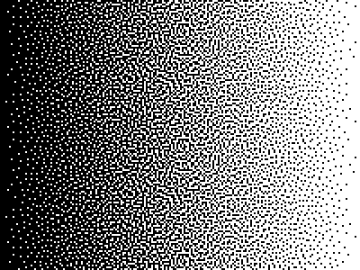
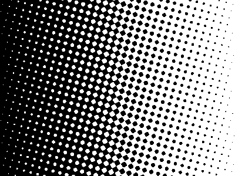
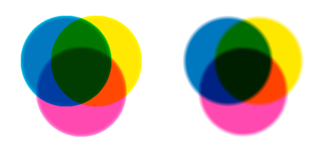

# RISO

**A risograph print emulator in your browser.** Drop in images, stack them as ink layers, and watch them overprint with all the beautiful accidents real riso is loved for — misregistration, ink bleed, halftone grain, and colors that mix like pigment instead of pixels.

**Try it: [jackbush.github.io/riso](https://jackbush.github.io/riso/)** — no install, no account, nothing uploaded anywhere. Everything runs locally in your browser.

## What's a risograph?

A risograph is a Japanese duplicator from the 80s — think "screen printing pretending to be a photocopier." It prints one vivid spot-color ink at a time, so multi-color prints are made by feeding the same paper through repeatedly, once per ink. The layers never line up perfectly, the inks are semi-transparent and mix where they overlap, and the whole thing has a warm, grainy, slightly-off charm that designers and artists adore.

This emulator simulates that process so you can experiment freely: separate your artwork into layers, assign each one a real Riso ink color, and tune the imperfections to taste. When it looks right, export a full-resolution PNG — or use it to plan color separations before spending money at an actual riso print shop.

---

## Using the emulator

### Quick start

1. **Drag an image (or PDF) anywhere onto the page.** Each image becomes a layer; each PDF page becomes its own layer. Or click **Add layers**.
2. **Click a layer's color swatch** and pick an ink. The palette is ~30 real Riso inks with accurate hex values — Fluorescent Pink and Blue is a classic first combo.
3. **Play with the toggles** in the settings panel until it feels like a print, not a screen.
4. Hit **Download** (bottom-left, next to the zoom controls — it shows the exact pixel size) to export a full-resolution PNG.

Every layer is converted to grayscale on import — dark areas become heavy ink, light areas become bare paper. That's exactly how a real riso "sees" your artwork, one color separation at a time. Up to 7 layers (a real print shop would charge you dearly for 7 passes).

### Layers

- **Reorder** by dragging the handle — layers print bottom-to-top, and order matters once inks overlap.
- **Rename** by clicking the name, **replace** the image by clicking the thumbnail, **remove** with ×.
- With **Layer opacity** enabled, each layer gets a slider — like asking the print shop for a lighter ink pass.
- With **Layer offset** enabled, each layer gets X/Y nudge controls for deliberate misalignment.

### Paper

Pick from presets (White, Eggshell, Natural, Stone, Newsprint) or type any hex color. Riso inks are translucent, so the paper glows through everything — the same print reads completely differently on newsprint than on bright white. **Safe area** adds a paper margin around the artwork.

### The imperfection toolbox

Real riso is charming *because* it's imperfect. Each effect below is off by default; turn them on and stack them.

**Ink transparency** — real inks aren't equally opaque: Black and Metallic Gold cover what's underneath, while Yellow and Fluorescent Pink are nearly pure dye. Each ink in the palette carries its own measured-ish transparency value; this toggle makes opaque inks partially *hide* lower layers instead of always multiplying into them.

**Ink spread** — riso ink soaks into the paper and spreads slightly past its edges (printers call this dot gain). A little softening (the 0–5 px slider) takes the digital crispness off and makes overlaps feel organic.

**Registration jitter** — every pass through a real riso lands a little differently. This shifts and rotates each layer by a small random amount. The randomness is seeded, so your preview is stable and the export matches it exactly — hit **Re-roll** when you want a different accident.

**Halftone** — riso can't print true grays, only dots of ink. Pick a mode:

| Stochastic | AM (dot screen) |
|---|---|
|  |  |
| Scattered grain, like modern riso output. One slider: grain size. | Classic printshop dots on a rotated grid. Sliders for dot spacing and screen angle. |

In AM mode, leave **Auto angles** on and each layer gets its own screen angle (0°, 15°, 45°, 75°) so overlapping screens don't fight. Turn it off to set one angle manually — and if you *want* moiré as a texture, setting two layers to nearly the same angle is how you get it.

**Kubelka-Munk mixing** — the big one. See below.

### Kubelka-Munk: making inks mix like actual ink

By default (like nearly every riso simulator), overlaps are computed with *multiply* blending — quick, decent, but it treats ink like colored cellophane. Real pigments both absorb *and scatter* light, and the Kubelka-Munk model from 1931 captures that. The practical difference:



Left is Kubelka-Munk, right is multiply — same three inks (Blue, Yellow, Fluorescent Pink). Blue + Yellow makes an actual green. Warm overlaps get richer, and triple overlaps go to deep ink tones instead of instant mud.

When it's on, the **Order bias** slider makes lower layers count slightly more in the mix — ink printed first soaks deeper into the paper. Kubelka-Munk replaces multiply blending entirely, so the ink transparency toggle rests while it's on.

<details>
<summary><strong>For the color nerds: what's actually computed</strong></summary>

Each ink's reflectance per RGB channel is inverted to an absorption/scattering ratio via the standard KM relation **K/S = (1 − R)² / 2R**. Per pixel, the K/S ratios of every layer (weighted by ink density and order bias) are summed on top of the paper's own K/S, then converted back to reflectance with **R = 1 + K/S − √((K/S)² + 2·K/S)**.

Honest caveats: doing this per RGB channel is a 3-channel approximation of what is properly a spectral (per-wavelength) computation, and true KM also models film thickness and interface reflections (Saunderson correction), which we skip. Reflectance is floored near 1/255 so pure black doesn't send K/S to infinity. The round-trip is exact enough that a single ink at full density on white paper reproduces its own hex within one 8-bit step — that's the unit test.

</details>

### Tips for good fake prints

- Start with **two layers, two inks**, and turn on ink transparency + a little spread + a little jitter. That alone reads as "riso" immediately.
- Duotone trick: put the *same* photo on two layers and give them different inks and a slight offset.
- Everything is specified in full-resolution pixels, and the export is what's authoritative — binary halftone dots can shimmer (alias) in the scaled-down preview even when the exported PNG is clean. To judge the real thing, click anywhere on the preview (or hit **100%** in the bottom-left zoom controls) to inspect that spot at true export resolution, one image pixel per physical screen pixel; drag to pan around, click again to zoom back out.

---

## Working on the project

### Setup

```
npm install
npm run dev      # Vite dev server
npm run test     # vitest
npm run build    # tsc --noEmit + vite build
```

React 19 + TypeScript + Vite. No state library — a `useLayerState` hook in `App` owns the layers, plain `useState` owns the config. Drag-to-reorder is `@dnd-kit`. Deploys to GitHub Pages via `.github/workflows/deploy.yml` on every push to `main` (note Vite `base: '/riso/'`).

### Architecture

The interesting code is `src/engine/`, and it's organized as a **density pipeline** — each stage is a pure function over grayscale "ink density" `ImageData` that no-ops when its feature is off:

```
upload → toGrayscale ─→ spread (blur.ts) ─→ halftone (halftone.ts) ─→ blend
                                                                       ├─ multiply path: tint + canvas 'multiply'
                                                                       └─ Kubelka-Munk path (kubelkaMunk.ts)
```

- `engine/compositor.ts` — orchestrates the pipeline and both blend paths; owns layer placement (centering, offsets, jitter, safe area)
- `engine/blur.ts` — 3-pass separable box blur (≈ Gaussian) for ink spread
- `engine/halftone.ts` — blue-noise matrix + both halftone screens
- `engine/kubelkaMunk.ts` — KM math as pure, tested functions
- `engine/prng.ts` — seeded PRNG (mulberry32) for jitter
- `engine/renderer.ts` — preview render + full-res PNG export
- `hooks/useRenderPipeline.ts` — debounced (150 ms) preview re-render + ResizeObserver

New effects should slot into the pipeline as a stage or a blend path — not as conditionals sprinkled through `composite()`.

### Key decisions (and the reasoning)

- **Everything is pixels, not physical units.** There's no DPI anywhere; halftone spacing, blur radii, and offsets are all in full-resolution pixels. Canvas size is the largest uploaded image, capped at 6400×6400 (≈ A3 at 400 dpi). Effects are applied to full-res data *before* the preview downscale, so preview shrinking scales them proportionally for free — never scale an effect radius by render scale, that double-applies it.
- **Randomness is always seeded.** Jitter uses mulberry32 keyed by `layer.id` ⊕ seed (keyed by id, not index, so reordering layers doesn't reshuffle their jitter). Export reuses the preview's seed and matches it exactly; new randomness only comes from the explicit Re-roll button.
- **Expensive stages are cached per layer.** Spread and halftone results are memoized in `WeakMap`s keyed by input `ImageData` + parameters, so a debounced re-render triggered by an unrelated slider doesn't re-blur a 6400px image. The caches chain (halftone caches on top of blurred output).
- **The blue-noise matrix is generated, not shipped.** 64×64 void-and-cluster with a fixed seed, built once on first use. Fixed seed ⇒ identical grain in preview and export.
- **Kubelka-Munk doesn't reimplement geometry.** The KM path rasterizes each layer's *density* onto a white output-sized canvas using the same shared placement code as the multiply path — so resampling, centering, jitter rotation, and opacity (`globalAlpha` over white scales density exactly) come free from `drawImage`. Only the per-pixel mixing loop is hand-written, and it runs in 256-row strips to keep memory bounded at export size.
- **K/S values are derived from hex at use time** (memoized), not stored in the palette — ink colors are user-customizable, so precomputed coefficients would break custom picks.
- **Mutual exclusions are modeled in the UI**, not silently resolved: stochastic and AM halftone share one dropdown; KM replaces multiply entirely (and supersedes ink transparency, with a hint); halftone + ink spread stack deliberately, also with a hint.

### Testing

`vitest` + jsdom. jsdom has no canvas, so the engine is written to keep math in pure functions over typed arrays (`ImageData` is polyfilled in tests) — blur kernels, PRNG determinism, halftone coverage/monotonicity, KM round-trips are all unit-tested, while canvas plumbing (`composite` itself) is verified in the browser. Keep it that way: if you add an effect, put the math where a test can reach it.

Config lives in `RisoConfig` (`src/types.ts`); defaults are initialized in `App.tsx`, so every new config field needs a default there. Each new effect gets: a type field, a default, a ConfigPanel control, a pipeline stage, and tests.
